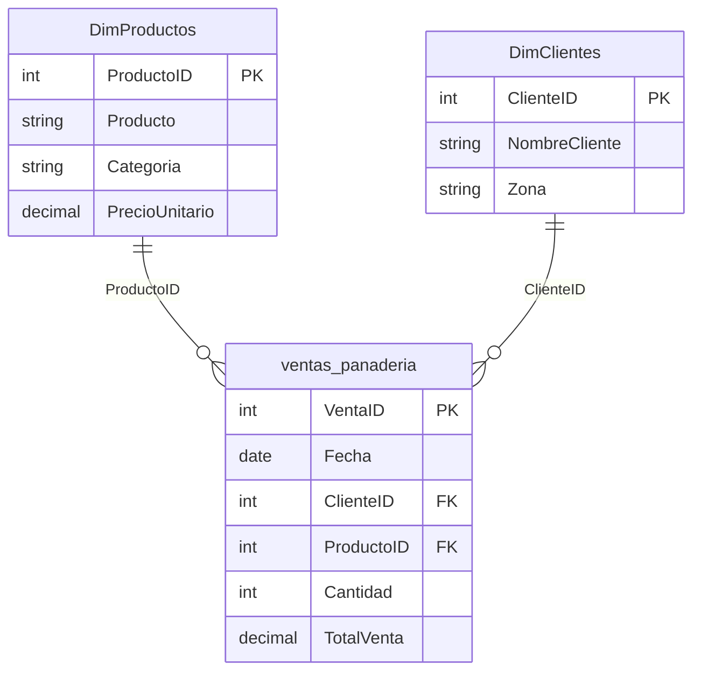
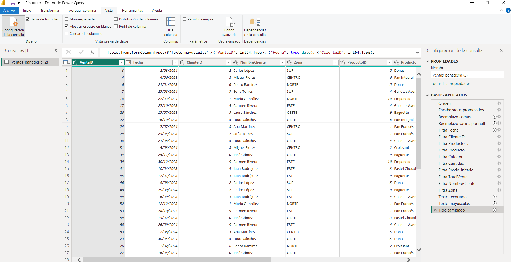
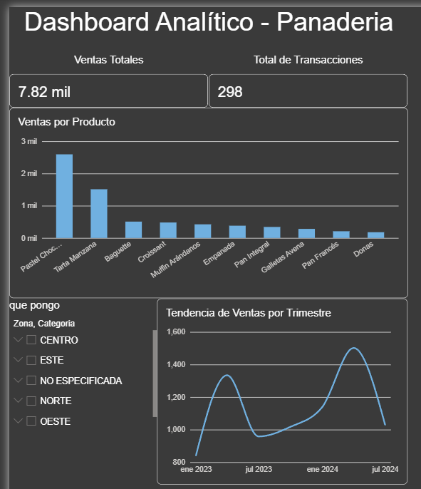

# Tarea 2: Dashboard Analítico - Panadería

| **Campo** | **Información** |
| :--- | :--- |
| **Curso:** | Seminario de Sistemas 2 |  
| **Carnet:** | 202203361 |
| **Nombre:** | Daniel Abraham Gálvez Solorzano |
| **Semestre:** | 2026-2 |

---

## 1. Información General

### 1.1 Descripción del Dataset

El dataset utilizado simula las ventas de una panadería durante el período 2023-2024. Contiene **500 registros originales** con la siguiente estructura:

| Campo | Descripción | Tipo |
|-------|-------------|------|
| VentaID | Identificador único de la transacción | Numérico |
| Fecha | Fecha de la venta | Fecha |
| ClienteID | Identificador del cliente | Numérico |
| NombreCliente | Nombre del cliente | Texto |
| Zona | Zona geográfica del cliente | Texto |
| ProductoID | Identificador del producto | Numérico |
| Producto | Nombre del producto | Texto |
| Categoria | Categoría del producto | Texto |
| Cantidad | Unidades vendidas | Numérico |
| PrecioUnitario | Precio por unidad | Numérico |
| TotalVenta | Monto total de la venta | Numérico |

**Categorías de productos:** Panes, Pasteles, Galletas, Salados  
**Zonas geográficas:** Norte, Sur, Centro, Este, Oeste

### 1.2 Modelo de Datos

El modelo implementado sigue un esquema de estrella con una tabla de hechos y dos tablas de dimensiones:

### Relaciones:
**DimProductos** → ventas_panaderia: Relación 1:N por ProductoID
**DimClientes** → ventas_panaderia: Relación 1:N por ClienteID

---

## 2. Transformaciones Realizadas en Power Query

### 2.1 Limpieza de datos

| Transformación | Columnas afectadas | Justificación |
|----------------|-------------------|---------------|
| Reemplazo de comas por puntos | Cantidad, PrecioUnitario, TotalVenta | Corregir formato decimal inconsistente |
| Conversión de celdas vacías a null | Todas las columnas | Estandarizar valores faltantes |

### 2.2 Estrategia de imputación (relleno)

En lugar de eliminar registros con datos faltantes en columnas no críticas, se aplicó una estrategia de imputación para conservar la mayor cantidad de datos posible:

| Columna | Valor null reemplazado por |
|---------|---------------------------|
| NombreCliente | "Cliente No Registrado" |
| Zona | "No Especificada" |
| Producto | "Producto No Identificado" |
| Categoria | "Sin Categoría" |

### 2.3 Eliminación selectiva

Se eliminaron únicamente los registros con valores nulos en columnas **críticas** para el análisis:

- **Fecha**: Imprescindible para el análisis temporal
- **ProductoID**: Necesario para relacionar con el catálogo
- **Cantidad**: Requerido para calcular volúmenes
- **PrecioUnitario** y **TotalVenta**: Esenciales para el análisis financiero

### 2.4 Estandarización de texto

- **Recorte de espacios**: Eliminación de espacios en blanco al inicio y final en columnas de texto (NombreCliente, Zona, Producto, Categoria)
- **Conversión a mayúsculas**: Estandarización de Zona y Categoria para facilitar filtros y agrupaciones

### 2.5 Conversión de tipos de datos

| Columna | Tipo original | Tipo final |
|---------|--------------|------------|
| VentaID | Texto | Número entero (Int64) |
| Fecha | Texto | Fecha (Date) |
| ClienteID | Texto | Número entero (Int64) |
| ProductoID | Texto | Número entero (Int64) |
| Cantidad | Texto | Número entero (Int64) |
| PrecioUnitario | Texto | Número decimal |
| TotalVenta | Texto | Número decimal |

### Resultado final

- **Registros originales:** 500
- **Registros finales:** 298 (59.6% de conservación)
- **Registros eliminados:** 202 (40.4%)

---

## 3. Dashboard

### Captura del Dashboard

### Visualizaciones incluidas

1. **KPI - Ventas Totales**: Tarjeta con el monto total de ventas
2. **KPI - Total de Transacciones**: Tarjeta con el número de ventas realizadas
3. **Gráfico de barras - Ventas por Producto**: Comparativo de ingresos por producto
4. **Gráfico de líneas - Tendencia de Ventas por Trimestre**: Evolución temporal de las ventas
5. **Segmentador - Zona y Categoría**: Filtro interactivo para analizar datos por zona geográfica y categoría de producto

---

## 4. Interpretación de los KPIs

### 4.1 Ventas Totales: 7.82 mil

El monto total de ventas alcanzado durante el período analizado es de **Q7,820**. Este indicador representa el ingreso bruto generado por la panadería y sirve como referencia principal para evaluar el desempeño financiero del negocio.

### 4.2 Total de Transacciones: 298

Se registraron **298 transacciones** en el período de análisis. Este KPI permite calcular el ticket promedio de venta (Q7,820 / 298 ≈ Q26.24 por transacción), lo cual es un indicador clave para evaluar el comportamiento de compra de los clientes.

### 4.3 Ventas por Producto

El análisis comparativo revela que:

- **Pastel de Chocolate** es el producto más vendido, generando aproximadamente Q2,500 en ingresos, lo que representa cerca del 32% del total de ventas.
- **Tarta Manzana** ocupa el segundo lugar con aproximadamente Q1,500.
- Los productos de menor venta son **Pan Francés** y **Donas**, con ingresos menores a Q200 cada uno.

**Recomendación:** Enfocar estrategias de marketing en los productos de mayor margen y evaluar si los productos de baja venta deben mantenerse en el catálogo o promocionarse mediante combos.

### 4.4 Tendencia de Ventas por Trimestre

El gráfico de líneas muestra un comportamiento estacional claro:

- **Primer trimestre 2023 (ene-mar):** Ventas iniciales alrededor de Q800
- **Segundo trimestre 2023 (abr-jun):** Pico de ventas alcanzando Q1,300
- **Tercer trimestre 2023 (jul-sep):** Descenso a Q950
- **Cuarto trimestre 2023 (oct-dic):** Recuperación a Q1,000
- **Segundo trimestre 2024 (abr-jun):** Máximo histórico de Q1,500
- **Tercer trimestre 2024 (jul-sep):** Descenso proyectado a Q1,000

**Patrón identificado:** Las ventas tienden a aumentar en el segundo trimestre de cada año (abril-junio), posiblemente asociado a temporadas festivas o de mayor consumo.

**Recomendación:** Planificar inventario y personal adicional para los trimestres de alta demanda, y diseñar promociones especiales para los trimestres de baja demanda.

---

## 5. Conclusiones

El dashboard analítico permite identificar que la panadería tiene un desempeño financiero positivo con ventas totales de Q7,820 en 298 transacciones. El Pastel de Chocolate es el producto estrella del negocio, y existe un patrón estacional de ventas que debe considerarse para la planificación operativa.

La estrategia de imputación de datos permitió conservar el 59.6% de los registros originales, garantizando un análisis robusto y representativo del comportamiento de ventas.

---

## 6. Estructura del Repositorio

SS22S2026_G14/
├── Tarea2/
│ ├── code/
│ │ └── dataset_generator.js
│ ├── data/
│ │ ── ventas_panaderia.csv
│ ├── dashboard.pbix
│ ├── dashboard.png
│ └── README.md

---

**Autor:** Daniel Abraham Gálvez Solorzano - 202203361  